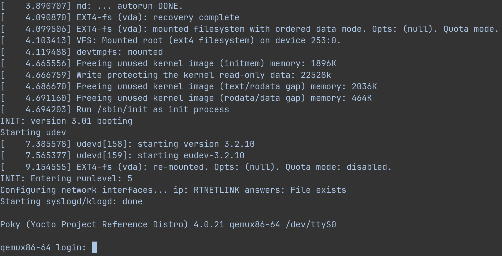

## Задание 2

__Задание выполняется в Rootless Mode Docker__

Используемый [Dockerfile](deploy/Dockerfile):

```
FROM ubuntu:20.04

RUN echo /usr/share/zoneinfo/Europe/Moscow > /etc/localtime && \
    echo /usr/share/zoneinfo/Europe/Moscow > /etc/timezone

RUN apt update && apt upgrade; \ 
    apt install -y sudo \
    gawk \
    wget \
    git \
    diffstat \
    unzip \
    texinfo \
    gcc \
    build-essential \
    chrpath \
    socat \
    cpio \
    python3 \
    python3-pip \
    python3-pexpect \
    xz-utils \
    debianutils \
    iputils-ping \
    python3-git \
    python3-jinja2 \
    python3-subunit \
    zstd \
    liblz4-tool \
    file \
    locales \
    libacl1 

RUN locale-gen en_US.UTF-8

RUN mkdir /home/user && \
    mkdir /home/user/images && \
    groupadd -g 1000 user && \
    useradd -u 1000 -g user -d /home/user -c /bin/bash user && \
    usermod -aG sudo user && \
    chown -R 1000:1000 /home/user && \
    chown -R 1000:1000 /home/user/images && \
    echo "user:changeme" | chpasswd

ENTRYPOINT bash "$TARGET.sh" \
           /bin/bash 

COPY scripts/build.sh \
     scripts/run.sh \
     /home/user/ 

ENV HOME=/home/user
WORKDIR /home/user 

USER user
```

Перед сборкой образа необходимо перейти в директорию `deploy`:

```
cd deploy
```

Образ контейнера собирается командой:

```
docker build -t <image_name>:<image_version> .
```

Собранный контейнер можно запустить командой:

```
docker run -itv <volume_name>:/home/user/images -e TARGET=<target> --name=<container_name> <image_name>:<image_version> 
```

В качестве `TARGET` можно передать `build` если нужно выполнить сборку `poky` или `run` если нужно выполнить запуск собранного образа

Собранный образ хранится в `~/.local/share/docker/volumes/`

Скрипт сборки [build.sh](deploy/scripts/build.sh):

```
#!/bin/bash
cd images

git clone git://git.yoctoproject.org/poky -b kirkstone

cd poky

. ./oe-init-build-env test-builds

bitbake core-image-minimal

exec "$@"
```

Скрипт запуска [run.sh](deploy/scripts/run.sh):

```
#!/bin/bash
cd images/poky

. ./oe-init-build-env

cd /home/user/images/poky/test-builds/tmp/deploy/images/

runqemu qemux86-64 slirp nographic

exec "$@"
```

После успешной сборки и запуска получим:

```
cd deploy

docker build -t test:v1 .

docker run -itv images:/home/user/images -e TARGET=build --name=yocto_build test:v1

docker run -itv images:/home/user/images -e TARGET=run --name=yocto_run test:v1
```



Может понадобиться использование [`--privileged`](https://docs.docker.com/reference/cli/docker/container/run/#privileged) при запуске контейнера, в случае возникновения проблем с гипервизором
