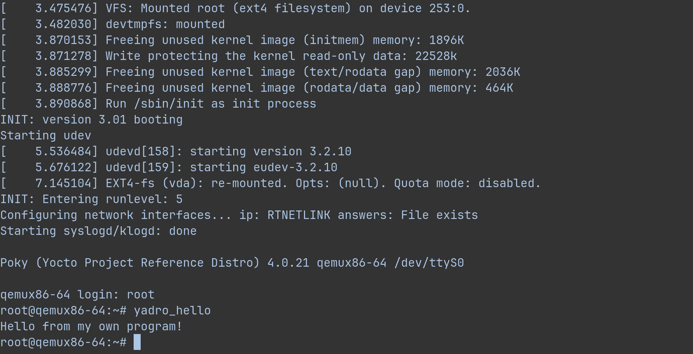

## Задание 3

__Задание выполняется в Rootless Mode Docker__

Используемый [Dockerfile](deploy/Dockerfile):

```
FROM ubuntu:20.04

RUN echo /usr/share/zoneinfo/Europe/Moscow > /etc/localtime && \
    echo /usr/share/zoneinfo/Europe/Moscow > /etc/timezone

RUN apt update && apt upgrade; \ 
    apt install -y sudo \
    gawk \
    wget \
    git \
    diffstat \
    unzip \
    texinfo \
    gcc \
    build-essential \
    chrpath \
    socat \
    cpio \
    python3 \
    python3-pip \
    python3-pexpect \
    xz-utils \
    debianutils \
    iputils-ping \
    python3-git \
    python3-jinja2 \
    python3-subunit \
    zstd \
    liblz4-tool \
    file \
    locales \
    libacl1  

RUN locale-gen en_US.UTF-8

RUN mkdir /home/user && \
    mkdir /home/user/images && \
    mkdir /home/user/scripts/ && \
    mkdir /home/user/src/ && \
    mkdir /home/user/conf/ && \
    groupadd -g 1000 user && \
    useradd -u 1000 -g user -d /home/user -c /bin/bash user && \
    usermod -aG sudo user && \
    chown -R 1000:1000 /home/user && \
    echo "user:changeme" | chpasswd

ENTRYPOINT bash "scripts/$TARGET.sh" \
           /bin/bash 

COPY scripts/build.sh \
     scripts/run.sh \
     scripts/add-layer.sh \
     /home/user/scripts/ 

COPY conf/layer.conf \
     conf/local.conf \
     conf/yadro-hello.bb \
     /home/user/conf/
COPY src/yadro_hello.c \
     /home/user/src/

ENV HOME=/home/user
WORKDIR /home/user 

USER user 
```

Перед сборкой образа необходимо перейти в директорию `deploy`:

```
cd deploy
```

Образ контейнера собирается командой:

```
docker build -t <image_name>:<image_version> .
```

Собранный контейнер можно запустить командой:

```
docker run -itv <volume_name>:/home/user/images -e TARGET=<target> --name=<container_name> <image_name>:<image_version> 
```

В качестве `TARGET` можно передать `build` если нужно выполнить сборку `poky`, `run` если нужно выполнить запуск собранного образа и `add-layer` если нужно добавить новый слой `meta-hello-layer` к образу

Собранный образ хранится в `~/.local/share/docker/volumes/`

Скрипт сборки [build.sh](deploy/scripts/build.sh):

```
#!/bin/bash
cd images

git clone git://git.yoctoproject.org/poky -b kirkstone

cd poky

. ./oe-init-build-env test-builds

bitbake core-image-minimal

exec "$@"
```

Скрипт запуска [run.sh](deploy/scripts/run.sh):

```
#!/bin/bash
cd images/poky

. ./oe-init-build-env test-builds

cd /home/user/images/poky/test-builds/tmp/deploy/images/

runqemu qemux86-64 slirp nographic

exec "$@"
```

Скрипт, добавляющий новый слой [add-layer.sh](deploy/scripts/add-layer.sh):

```
#!/bin/bash
cd $HOME/images/poky/

mkdir meta-hello-layer/

cd meta-hello-layer/

mkdir conf/ recipes-example/

mkdir recipes-example/yadro-hello/

mkdir recipes-example/yadro-hello/yadro-hello/

cp $HOME/conf/layer.conf $HOME/images/poky/meta-hello-layer/conf/

cp $HOME/conf/local.conf $HOME/images/poky/test-builds/conf/

cp $HOME/conf/yadro-hello.bb $HOME/images/poky/meta-hello-layer/recipes-example/yadro-hello/

cp $HOME/src/yadro_hello.c $HOME/images/poky/meta-hello-layer/recipes-example/yadro-hello/yadro-hello/

cd $HOME/images/poky/

. ./oe-init-build-env test-builds

bitbake-layers create-layer ../meta-hello-layer

bitbake-layers add-layer ../meta-hello-layer

bitbake core-image-minimal

exec "$@"
```

После успешной сборки, запуска и добавления нового слоя получим:

```
cd deploy

docker build -t test:v1 .

docker run -itv images:/home/user/images -e TARGET=build --name=yocto_build test:v1

docker run -itv images:/home/user/images -e TARGET=add-layer --name=yocto_add_layer test:v1

docker run -itv images:/home/user/images -e TARGET=run --name=yocto_run test:v1
```



Может понадобиться использование [`--privileged`](https://docs.docker.com/reference/cli/docker/container/run/#privileged) при запуске контейнера, в случае возникновения проблем с гипервизором

